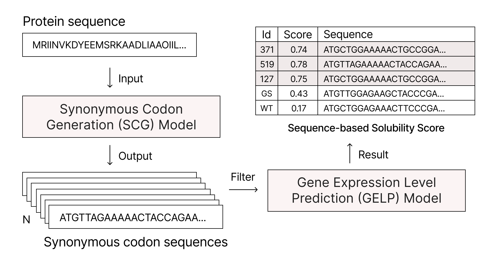

# SCG-GELP

**S**ynonymous **C**odon **G**enerator for **G**ene **E**xpression **L**evel **P**rediction

A deep learning-guided synonymous codon optimization toolkit. Given a protein
sequence, SCG-GELP generates multiple synonymous DNA sequences and predicts their
soluble expression probability in *Escherichia coli* through a three-stage
pipeline:



---

## Table of Contents

- [Requirements](#requirements)
- [Installation](#installation)
- [Model Weights](#model-weights)
- [Quick Start](#quick-start)
- [Usage](#usage)
  - [Command Line](#command-line)
  - [Python API](#python-api)
- [Configuration](#configuration)
- [Citation](#citation)
- [License](#license)

---

## Requirements

| Item | Version |
|------|---------|
| Python | 3.12 |
| CUDA | 11.8 (for GPU inference) |
| OS | Linux (tested on Ubuntu 22.04) |

Key dependencies:

- PyTorch 2.6.0 + CUDA 11.8
- Transformers 4.55.3
- scikit-learn 1.7.1
- XGBoost 3.2.0, LightGBM 4.6.0
- einops 0.8.1

> **Note:** `triton` must be uninstalled after installing PyTorch to avoid a
> known DNABERT-2 compatibility issue
> ([MAGICS-LAB/DNABERT_2#57](https://github.com/MAGICS-LAB/DNABERT_2/issues/57)).

---

## Installation

### Option 1: Docker (Recommended)

```bash
# Pull the base image
docker pull nvidia/cuda:11.8.0-cudnn8-runtime-ubuntu22.04

# Run a container with GPU access
docker run -id --name scg_gelp \
    -w /opt \
    --gpus device=0 \
    nvidia/cuda:11.8.0-cudnn8-runtime-ubuntu22.04

docker exec -it scg_gelp bash

# Install system tools
apt-get update && apt-get install -y git vim wget

# Install Miniforge
wget "https://github.com/conda-forge/miniforge/releases/latest/download/Miniforge3-$(uname)-$(uname -m).sh" && \
bash Miniforge3-$(uname)-$(uname -m).sh -b -u -p /opt/miniconda3 && \
/opt/miniconda3/bin/conda init bash && \
source ~/.bashrc

# Create environment
conda create -n scg_gelp python=3.12 -y
conda activate scg_gelp

# Install Python dependencies
pip install torch==2.6.0 torchvision==0.21.0 torchaudio==2.6.0 \
    --index-url https://download.pytorch.org/whl/cu118

conda install tqdm scikit-learn==1.7.1 transformers==4.55.3 -y
pip install xgboost==3.2.0 lightgbm==4.6.0
conda install einops==0.8.1 -y

pip uninstall triton -y

# Clone the repository
git clone https://github.com/yuddecho/SCG-GELP.git
cd SCG-GELP
```

### Option 2: Conda / venv (Bare-metal)

If you already have CUDA 11.8 and conda configured:

```bash
conda create -n scg_gelp python=3.12 -y
conda activate scg_gelp

pip install -r requirements.txt
pip uninstall triton -y
```

---

## Model Weights

Download the pretrained weights from
[GitHub Releases](https://github.com/yuddecho/SCG-GELP/releases/tag/weights)
and place them as follows:

| File | Size | Destination | Description |
|------|------|-------------|-------------|
| `sk_best_models.tar.gz` | ~21 MB | `weights/sk_best_models/` | 14 individually trained sklearn ensemble models |
| `scg_checkpoint.pt` | ~148 MB | `weights/scg_checkpoint.pt` | SCG-Transformer generation model |
| `pytorch_model.bin` | ~447 MB | `dnabert2/pytorch_model.bin` | Fine-tuned DNABERT-2 feature extractor |

```bash
wget https://github.com/yuddecho/SCG-GELP/releases/download/weights/sk_best_models.tar.gz
wget https://github.com/yuddecho/SCG-GELP/releases/download/weights/scg_checkpoint.pt
wget https://github.com/yuddecho/SCG-GELP/releases/download/weights/pytorch_model.bin

mkdir -p weights
tar xzf sk_best_models.tar.gz -C weights/
mv scg_checkpoint.pt weights/
mv pytorch_model.bin dnabert2/
```

---

## Quick Start

Example data is provided in `data/example/`:

```bash
# Batch run on example proteins with reference gene sequences
python run.py --input data/example/proteins.csv --reference data/example/ref_genes.csv
```

Results are saved to `data/example/outputs/` by default.

---

## Usage

### Command Line

```bash
# Single protein
python run.py \
    --protein_name MR \
    --protein_seq "MRIINVKDYEEMSRKAADLIAAQIILNPKSSLGLAHGKSPIGFYERLVELNRNGVIDFSHVTTINLDEYYGLDPTHDQSYRYFMNKHLFSRVNINMANTHLPDGKAKDIDAECIRYDDLIESVGGIDLQLLGIGHNGHIFFNEPSDEFIPGTHCVSLSQSTINANSLMYFSRDEVQRKAITMGIKAIMQARYVQLIASGEDQIEILKKALFGPITPQVPASILQLHKDLTVITPLDI*"

# Single protein with reference genes for comparison
python run.py \
    --protein_name MK \
    --protein_seq "MKVWLVG...*" \
    --reference data/example/ref_genes.csv

# Batch processing from CSV
python run.py --input data/example/proteins.csv

# Batch with reference genes
python run.py --input data/example/proteins.csv --reference data/example/ref_genes.csv
```

#### Input CSV (`protein_name,protein_sequence`)

| protein_name | protein_sequence |
|--------------|------------------|
| MRI | MRIINVKD...\* |
| MKV | MKVWLVG...\* |

#### Reference CSV (`protein_name,gene_name,gene_sequence`)

| protein_name | gene_name | gene_sequence |
|--------------|-----------|---------------|
| MRI | WT | ATGCGTATC... |
| MRI | GS | ATGCGTATC... |
| MKV | GS | ATGAAAGTT... |

Reference sequences are merged with SCG-generated candidates and evaluated
together, allowing direct comparison of known optimized sequences against the
model's output. Reference genes are always evaluated even when the SCG
generation stage is disabled in `config.py`.

#### Output CSV (sorted by `total_rank`, best first)

| name | svm_acc | svm_rank | lr_acc | lr_rank | mlp_acc | mlp_rank | total_acc | total_rank | sequence |
|------|---------|----------|--------|---------|---------|----------|-----------|------------|----------|
| MRI_scg_3 | 0.937 | 1 | 0.958 | 1 | 0.973 | 2 | 0.956 | 1.667 | ATGAGA... |
| WT | 0.949 | 2 | 0.928 | 3 | 0.951 | 1 | 0.931 | 6.250 | ATGCGT... |

- `<model>_acc` – predicted soluble expression probability by that classifier.
- `<model>_rank` – rank within this classifier (1 = highest probability).
- `total_acc` – average probability across selected classifiers.
- `total_rank` – average rank across selected classifiers (primary sort key).

### Python API

```python
from scg_gelp import run, get_ranking

# Run the full pipeline
res = run(
    protein_name='MR',
    protein_seq='MRIINVKDYEEMSRKAADLIAAQIILNPKSSLGLAHGKSPIGFYERLVELNRNGVIDFSHVTTINLDEYYGLDPTHDQSYRYFMNKHLFSRVNINMANTHLPDGKAKDIDAECIRYDDLIESVGGIDLQLLGIGHNGHIFFNEPSDEFIPGTHCVSLSQSTINANSLMYFSRDEVQRKAITMGIKAIMQARYVQLIASGEDQIEILKKALFGPITPQVPASILQLHKDLTVITPLDI**',
    reference_dnas={'WT': 'ATGAAAGTT...'},   # optional
)

# Get ranked results
ranking = get_ranking(res)
for seq_name, prob, rank in ranking:
    print(f'Rank {rank}: {seq_name} (score={prob:.3f})')
```

---

## Configuration

Advanced behaviour is controlled in `config.py` (project root):

| Setting | Default | Description |
|---------|---------|-------------|
| `DEFAULT_SELECTED_MODELS` | `['SVM', 'LR', 'MLP']` | Classifiers used in the ensemble. Choose any subset of the 14 available algorithms (AdaBoost, Bagging, DT, KNN, LDA, LR, MLP, NB, QDA, RF, SGD, SVM, XGBoost, GB). |
| `BEAM_BATCH_SIZES` / `BEAM_WIDTHS` / `BEAM_SIZES` | `[1,2,4,8,16,32]` / `[2,2,3,4,5,5]` / `[20,40,80,...]` | Multi-round beam-search parameters. Higher values generate more candidates at the cost of speed. |
| `EXEC_FUNC` | all `True` | Toggle individual pipeline stages on/off. Useful for re-running only the ranking stage on existing candidates. |

No code changes are required for normal use; edit `config.py` before running
`run.py`.

---

## Citation

If you use SCG-GELP in your research, please cite:

> Yu, D.; Geng, N.; Fan, L.; Qin, Y.; Sun, S.; Chen, H.; Wang, R.; Liao, X.;
> You, C. Deep Learning-Guided Reverse Translation Enhances Soluble Expression
> of Recombinant Proteins in *Escherichia coli*. *Preprints* **2026**, 2026051014.
> https://doi.org/10.20944/preprints202605.1014.v1

---

## License

This project is licensed under the Apache License 2.0. See [LICENSE](LICENSE) for
details.
